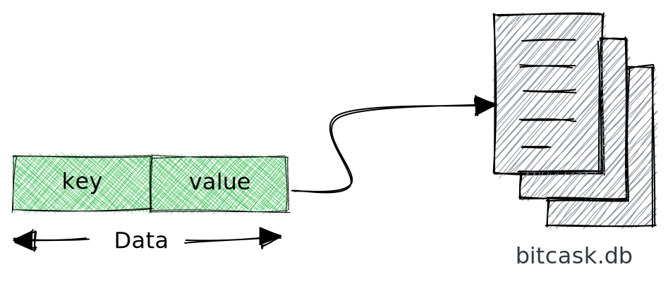
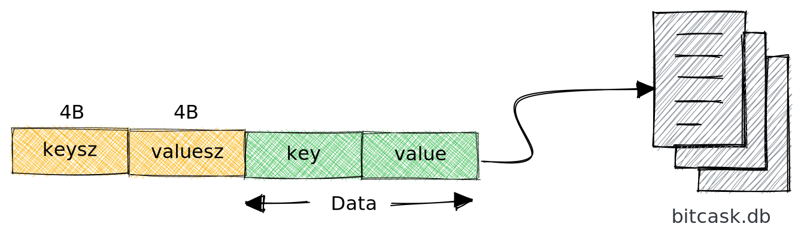
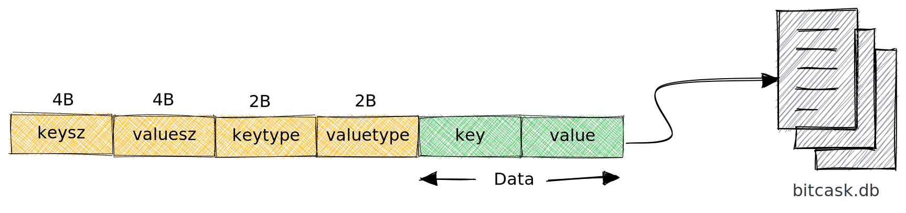
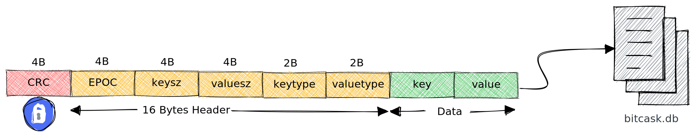

Databases have always fascinated me, and I have always dreamt of building a simple, hobby database for fun.
I have read several blog posts about building redis, git, compiler, and interpreter, but none about building a database. This post is an outcome of a long and treacherous search of posts on making a database and eventually encountering the [Bitcask paper](https://riak.com/assets/bitcask-intro.pdf).

### Bitcask

[Bitcask](https://riak.com/assets/bitcask-intro.pdf) is a local key/value store where the data is persisted in a file. One operating system process will open the file for writing at any time. When the file size reaches a considerable theoretical threshold, we close the file and open a new one.

#### Goals

1. Low latency per item, read or written.
2. High throughput, especially when writing an incoming stream of random items.
3. Ability to handle datasets much more significant than RAM w/o degradation.
4. Crash friendliness, both in terms of a fast recovery and not losing data.
5. Ease of backup and restore.
6. A relatively simple, understandable code structure and data format.

### Data Format

Let's start breaking it down. 

#### What's the essential thing that we need to store?

1. Key
2. Value



#### Given a cursor seeked to the location of the data in the file, will you be able to read the data?

The answer is No!

**Let me explain**

As key and value is variable length. We will need to figure out how much to read. So we need to store the size of the key and its value.



Now that we have the key and value size written in the file. Given a file cursor pointing to the location of the data. We know the first 8 bytes represent key and value size. Once we read that, we see the size of the actual key and the value to be read.

#### Storing primitive data types

Although our kv database is MVP-ready. Suppose we want to store data types like integer, float and string. Once the data is written in the file, the data type is lost, and everything will be treated as a string, as we are not storing any information.

To preserve type information, let's store two more fields, `keytype` and `valuetype`, representing the type of data stored.



#### Auditing & Security

For auditing and security, bitcask suggests storing 32-bit EPOC timestamp and [CRC(Cyclic Redundancy Check)](https://en.wikipedia.org/wiki/Cyclic_redundancy_check), respectively. These values are generated when data is written to the file.

The final data format would look like something below. We would store 20 bytes of additional data for every key and value.

- 1st 4 bytes are a 32-bit integer representing CRC.
- The following 4 bytes are a 32-bit integer representing EPOC timestamp.
- The following 8 bytes are two 32-bit integers representing `keysize` and `valuesize`.
- The next 4 bytes are two 16-bit integers representing `keytype` and `valuetype`.
- The remaining bytes are our key and value. 



### Number System

Computers represent data in sets of binary digits. The representation comprises bits grouped into more extensive collections, such as bytes. The first 24 bytes are unsigned integers if you notice our data format. By default, when integers are written to a file, they are not stored in binary.

**Let me explain**

Suppose we run the below code. What would be the size of the data written in the file?

```ruby
File.open('sample.txt', 'w') do |file|
    [1, 12, 123, 1234, 12345, 123456, 1234567, 12345678].each do |num|
        file.write(num)
    end
end
```

It's **36** bytes because, by default, they are written as strings where each character is 1 byte. But this could be more efficient. In our data format, we discussed that for any key and value, we would be storing 20 bytes of metadata. So we cannot keep them as strings, as it would result in a variable length field. The solution is to encode it and store it in binary format.

If we encoded them as 4-byte integers and stored them in binary format. The size of the file would **32** bytes.

$${\textsf{ 4 * 8 = 32 bytes}}$$

### Largest Key & Value Size

The largest `key` or `value` stored in file is a function of the type of integer of `keysize` or `valuesize` respectively.

$${\large{\mathsf{\max_{\substack{\mathsf{1<x<2^{x}-1}}} f(x)}}} \\ \textsf{where x is the size of an integer in bits}$$

As our `keysize` or `valuesize` are 4 bytes(32 bits) unsigned integers. The largest value of key or value that we can store is 

$${{\mathsf{ 2^{32-1}} = \textsf{4294967296 bytes =  4.2 GB}}}$$

### Algorithm
