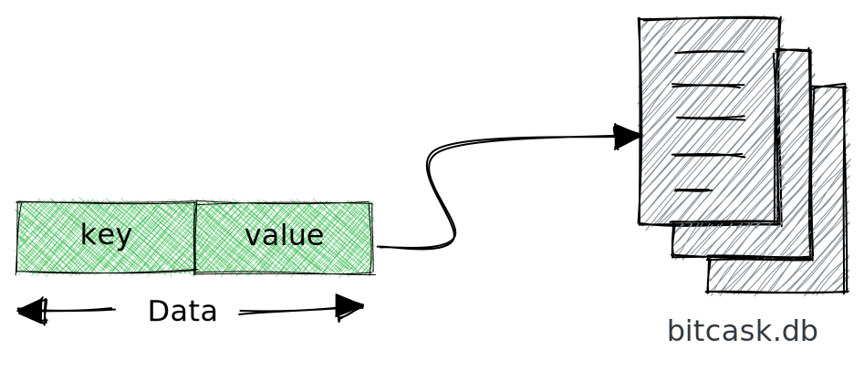
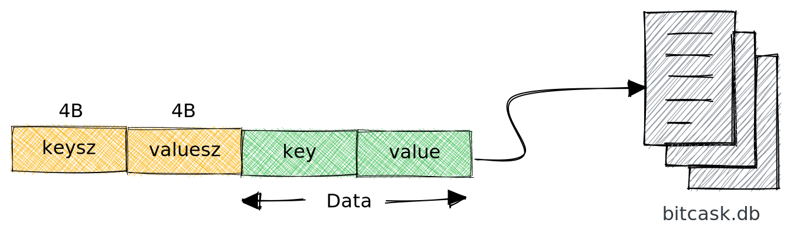
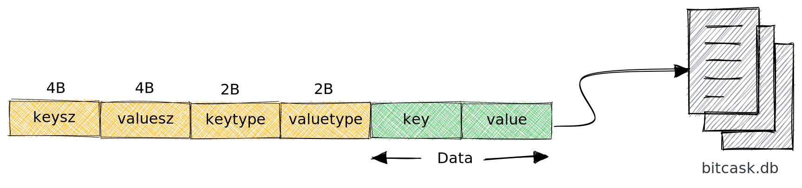
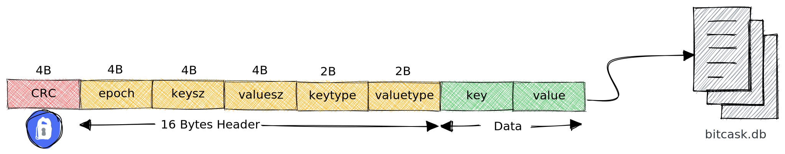

Databases have always fascinated me, and I have always dreamt of building a simple, hobby database for fun.
I have read several blog posts about building redis, git, compiler, and interpreter, but none about building a database. This post is an outcome of a long and treacherous search of posts on making a database and eventually encountering the [Bitcask paper](https://riak.com/assets/bitcask-intro.pdf).

### Bitcask

[Bitcask](https://riak.com/assets/bitcask-intro.pdf) is a local key/value store where the data is persisted in a file. One operating system process will open the file for writing at any time. When the file size reaches a considerable theoretical threshold, we close the file and open a new one.

#### Goals

1. Low latency per item, read or written.
2. High throughput, especially when writing an incoming stream of random items.
3. Ability to handle datasets much more significant than RAM w/o degradation.
4. Crash friendliness, both in terms of a fast recovery and not losing data.
5. Ease of backup and restore.
6. A relatively simple, understandable code structure and data format.

### Data Format

Let's start breaking it down.

#### What's the essential thing that we need to store?

1. Key
2. Value



#### Given a cursor at the location of the data in file, will you be able to read the data?

The answer is No!

**Let me explain**

As key and value is variable length. We will need to figure out how much to read. So we need to store the size of the key and its value.



Now that we have the key and value size written in the file. Given a file cursor pointing to the location of the data. We know the first 8 bytes represent key and value size. Once we read that, we see the size of the actual key and the value to be read.

#### Storing primitive data types

Although our kv database is MVP-ready. Suppose we want to store data types like integer, float and string. Once the data is written in the file, the data type is lost, and everything will be treated as a string, as we are not storing any information.

To preserve type information, let's store two more fields, `keytype` and `valuetype`, representing the type of data stored.



#### Auditing & Security

For auditing and security, bitcask suggests storing 32-bit epoch timestamp and [CRC(Cyclic Redundancy Check)](https://en.wikipedia.org/wiki/Cyclic_redundancy_check), respectively. These values are generated when data is written to the file.

The final data format would look like something below. We would store 20 bytes of additional data for every key and value.

- 1st 4 bytes are a 32-bit integer representing CRC.
- The following 4 bytes are a 32-bit integer representing epoch timestamp.
- The following 8 bytes are two 32-bit integers representing `keysize` and `valuesize`.
- The next 4 bytes are two 16-bit integers representing `keytype` and `valuetype`.
- The remaining bytes are our key and value.



### Number System

Computers represent data in sets of binary digits. The representation comprises bits grouped into more extensive collections, such as bytes. The first 24 bytes are unsigned integers if you notice our data format. By default, when integers are written to a file, they are not stored in binary.

**Let me explain**

Suppose we run the below code. What would be the size of the data written in the file?

```ruby
File.open('sample.txt', 'w') do |file|
    [1, 12, 123, 1234, 12345, 123456, 1234567, 12345678].each do |num|
        file.write(num)
    end
end
```

It's **36** bytes because, by default, they are written as strings where each character is 1 byte.

$${\textsf{ 1 + 2 + 3 + 4 + 5 + 6 + 7 + 8 = 36 bytes}}$$

But this could be more efficient. In our data format, we discussed that for any key and value, we would be storing 20 bytes of metadata. So we cannot keep them as strings, as it would result in a variable length field. The solution is to encode it and store it in binary format.

If we encoded them as 4-byte integers and stored them in binary format. The size of the file would **32** bytes.

$${\textsf{ 4 * 8 = 32 bytes}}$$

### Largest Key & Value Size

The largest `key` or `value` stored in file is a function of the type of integer of `keysize` or `valuesize` respectively.

$${\large{\mathsf{\max_{\substack{\mathsf{1<x<2^{x}-1}}} f(x)}}}  \textsf{where x is the size of an integer in bits}$$

As our `keysize` or `valuesize` are 4 bytes(32 bits) unsigned integers. The largest value of key or value that we can store is

$${{\mathsf{ 2^{32-1}} = \textsf{4294967295 bytes =  4.29 GB}}}$$

### Stiching Everything

Let's create a `Serializer` module which encapsulates serialization and deserialization logic. We need to encode our data into a binary sequence. Ruby has [Array.pack](https://apidock.com/ruby/Array/pack), which packs the data into a binary sequence according to a directive. Directives inform how data should be encoded in a binary sequence. Below is the list of directives we will be using.

1. **L<** : 32-bit unsigned integer, little endian (uint32_t)
2. **S<** : 16-bit unsigned integer, little endian (uint16_t)
3. **q<** : 64-bit signed integer, little endian (int64_t)
4. **E**  : double-precision, little-endian

All of our directives have little-endian byte order. This does not have any performance benefit. You can encode them in big-endian order as well. We specify the endianness to ensure our database file is cross-platform compatible.

```ruby {linenos=table, title="serializer.rb"}
module Bitcask
  module Serializer

    HEADER_FORMAT = 'L<L<L<S<S<'
    HEADER_SIZE = 16

    CRC32_FORMAT = 'L<'
    CRC32_SIZE = 4

    DATA_TYPE = {
      Integer: 1,
      Float: 2,
      String: 3
    }.freeze

    DATA_TYPE_LOOK_UP = {
      DATA_TYPE[:Integer] => :Integer,
      DATA_TYPE[:Float] => :Float,
      DATA_TYPE[:String] => :String
    }.freeze

    DATA_TYPE_DIRECTIVE = {
      DATA_TYPE[:Integer] => 'q<',
      DATA_TYPE[:Float] => 'E'
    }.freeze

  end
end
```

#### Serialize & Deserialize

1. `serialize` serializes the data to our data format. It identifies the type of data, generates a header and computes crc. It returns the length of the data and the binary encoded data.
2. `deserialize` does the opposite of `serialize`. It validates crc, decodes the binary encoded data and returns epoch, key and value.

```ruby {linenos=table,linenostart=27,title="serializer.rb"}
module Bitcask
  module Serializer

    def serialize(epoch:, key:, value:)
      key_type = type(key)
      value_type = type(value)

      key_bytes = pack(key, key_type)
      value_bytes = pack(value, value_type)

      header = serialize_header(epoch: epoch, keysz: key_bytes.length, key_type: key_type, value_type: value_type,
                                valuesz: value_bytes.length)
      data = key_bytes + value_bytes

      [crc32_header_offset + data.length, crc32(header + data) + header + data]
    end

    def deserialize(data)
      return 0, '', '' unless crc32_valid?(desearlize_crc32(data[..crc32_offset - 1]), data[crc32_offset..])

      epoch, keysz, valuesz, key_type, value_type = deserialize_header(data[crc32_offset..crc32_header_offset - 1])
      key_bytes = data[crc32_header_offset..crc32_header_offset + keysz - 1]
      value_bytes = data[crc32_header_offset + keysz..]

      [epoch, unpack(key_bytes, key_type), unpack(value_bytes, value_type)]
    end

    def serialize_header(epoch:, key_type:, keysz:, value_type:, valuesz:)
      [epoch, keysz, valuesz, DATA_TYPE[key_type], DATA_TYPE[value_type]].pack(HEADER_FORMAT)
    end

    def deserialize_header(header_data)
      header = header_data.unpack(HEADER_FORMAT)

      [header[0], header[1], header[2], DATA_TYPE_LOOK_UP[header[3]], DATA_TYPE_LOOK_UP[header[4]]]
    end

  end
end
```

Below are a few helper functions used for packing, unpacking and generating crc.

```ruby {linenos=table,linenostart=66,title="serializer.rb"}
module Bitcask
  module Serializer

    def crc32_offset
      CRC32_SIZE
    end

    def header_offset
      HEADER_SIZE
    end

    def crc32_header_offset
      crc32_offset + header_offset
    end

    def crc32(data_bytes)
      [Zlib.crc32(data_bytes)].pack(CRC32_FORMAT)
    end

    def desearlize_crc32(crc)
      crc.unpack1(CRC32_FORMAT)
    end

    def crc32_valid?(digest, data_bytes)
      digest == Zlib.crc32(data_bytes)
    end

    def pack(attribute, attribute_type)
      case attribute_type
      when :Integer, :Float
        [attribute].pack(directive(attribute_type))
      when :String
        attribute.encode('utf-8')
      else
        raise StandardError, 'Invalid attribute_type for pack'
      end
    end

    def unpack(attribute, attribute_type)
      case attribute_type
      when :Integer, :Float
        attribute.unpack1(directive(attribute_type))
      when :String
        attribute
      else
        raise StandardError, 'Invalid attribute_type for unpack'
      end
    end

    private

    def directive(attribute_type)
      DATA_TYPE_DIRECTIVE[DATA_TYPE[attribute_type]]
    end

    def type(attribute)
      attribute.class.to_s.to_sym
    end

  end
end
```

#### DiskStore

Finally, let us create a class called `DiskStore`, our persistent key-value store. It has the following methods.

1. **Get** : Returns value for a given key from the store.


flowchart LR;
    A([get]) --> C{key in <br/> look_up table?}
    C -->|yes| D(seek to <br/> data loc in file)
    D --> F(read <br/> log_size bytes)
    F --> G{crc valid?}
    G --> |no| E
    G --> |yes| H(deserialize)
    H --> J(return value)
    C -->|no| E(return <br/> empty string)


2. **Put** : Write key-value into the store.


flowchart LR;
    A([put]) --> B(generate epoch)
    B --> C(serialize data)
    C --> G(add to key_dir)
    G --> D(write to file)
    D --> E(incr write_pos </br> by data size)
    E --> F(return)


```ruby {title="disk_store.rb"}
module Bitcask
  class DiskStore

    include Serializer

    def initialize(db_file = 'bitcask.db')
      @db_fh = File.open(db_file, 'a+b')
      @write_pos = 0
      @key_dir = {}
    end

    def get(key)
      key_struct = @key_dir[key]
      return '' if key_struct.nil?

      @db_fh.seek(key_struct[:write_pos])
      epoch, key, value = deserialize(@db_fh.read(key_struct[:log_size]))

      value
    end

    def put(key, value)
      log_size, data = serialize(epoch: Time.now.to_i, key: key, value: value)

      @key_dir[key] = key_struct(@write_pos, log_size, key)
      persist(data)
      incr_write_pos(log_size)

      nil
    end

    def flush
      @db_fh.flush
    end

    private

    def persist(data)
      @db_fh.write(data)
      @db_fh.flush
    end

    def incr_write_pos(pos)
      @write_pos += pos
    end

    def key_struct(write_pos, log_size, key)
      { write_pos: write_pos, log_size: log_size, key: key }
    end

  end
end
```

### Closing thoughts

To avoid overloading you folks with too much data, I have left out a few things from the article. The next improvement that you should be thinking about is **How to initialize the DiskStore with a pre-existing data file?**

You can implement it in the language of your choice. If you are blocked anywhere, check out the complete working code at **https://github.com/dineshgowda24/bitcask-rb**. It has implementations for initializing the `DiskStore` with a pre-existing data file and benchmarks if you are interested in any of those.

*Happy implementing your own KV store!*
