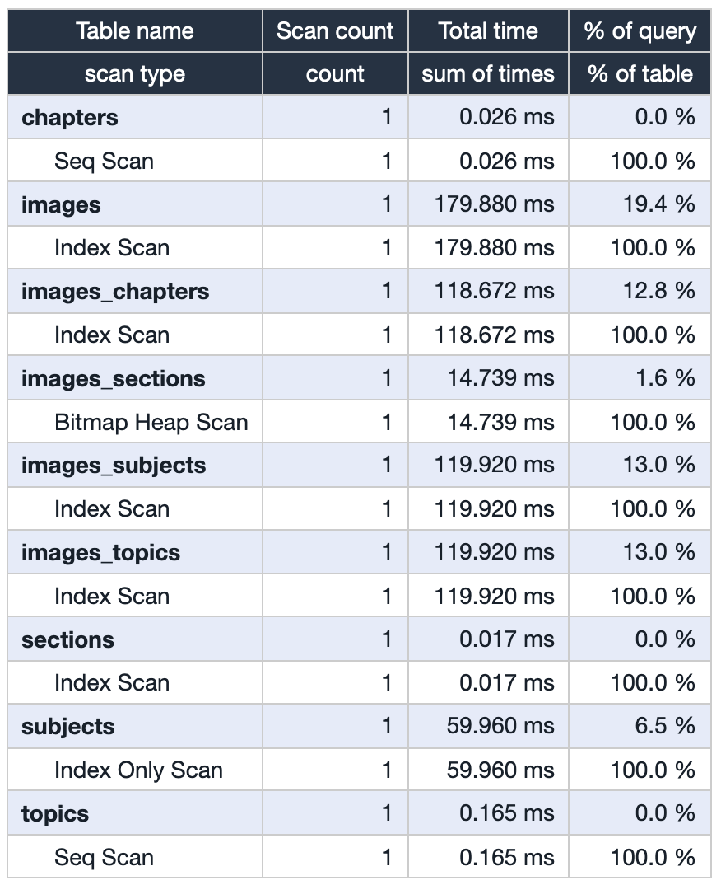
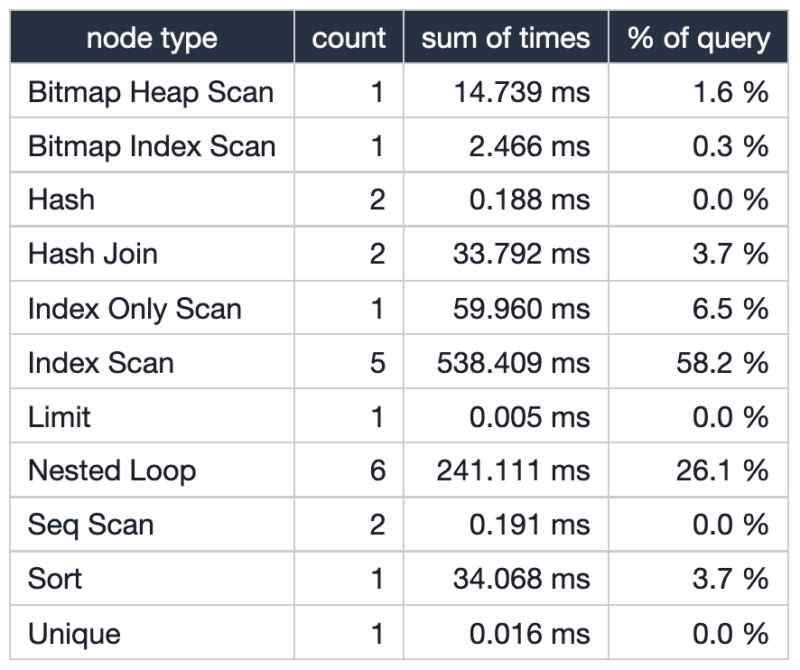
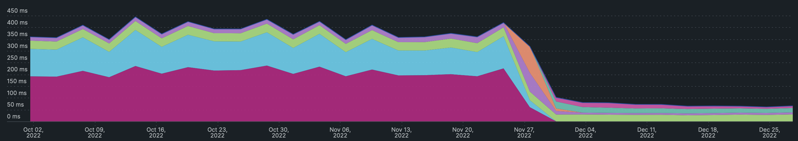

I have been working with a client with close to 600k images on their home page. The photos are tagged with multiple categories. The index API returns paginated pictures based on various sets of filters on classes.

Recently, they normalized their data, and every image was mapped to 4 different categories through join tables. So to load the home page, the app server used to join 8 tables on runtime and return the results.

Below is the query that filters the images tagged `ABSTRACT` for a page and limit results to 10.

```sql
select distinct on (images.id) external_uuid
from images
         join images_chapters qc on images.id = qc.image_id
         join chapters c on c.id = qc.chapter_id
         join images_sections qs on images.id = qs.image_id
         join sections s on s.id = qs.section_id
         join images_subjects qs2 on images.id = qs2.image_id
         join subjects s2 on s2.id = qs2.subject_id
         join images_topics qt on images.id = qt.image_id
         join topics t on t.id = qt.topic_id
where s.name = 'abstract'
order by images.id
offset <offset_page> limit 10
```

The count on the actual category tables is meagre <5k rows per table. The join tables have mostly 1(images):1(categories) mapping. Meaning every image has at least been tagged into 4 categories. If our filter predicate results in 100k images, we are essentially joining 5 tables ( images + 4 classes) of 100k each.

### Let's break down the EXPLAIN statement

Below is the result of `EXPLAIN ANALYZE` that filters the images tagged `ABSTRACT` for a specific page, sorts by `images.id`, and returns the first 10 results.

```sql
Limit  (cost=2256.12..2256.17 rows=10 width=45) (actual time=939.317..939.329 rows=10 loops=1)
  ->  Unique  (cost=2255.87..2257.11 rows=248 width=45) (actual time=939.292..939.324 rows=60 loops=1)
        ->  Sort  (cost=2255.87..2256.49 rows=248 width=45) (actual time=939.291..939.308 rows=64 loops=1)
                Sort Key: images.id
                Sort Method: external merge Disk: 3648kB
              ->  Hash Join  (cost=181.85..2246.01 rows=248 width=45) (actual time=3.048..905.152 rows=64082 loops=1)
                    ->  Nested Loop  (cost=136.55..2200.06 rows=248 width=53) (actual time=2.730..887.310 rows=64082 loops=1)
                          ->  Nested Loop  (cost=136.13..2084.93 rows=236 width=69) (actual time=2.713..704.197 rows=59960 loops=1)
                                ->  Nested Loop  (cost=135.98..2045.35 rows=236 width=77) (actual time=2.701..606.176 rows=59960 loops=1)
                                      ->  Nested Loop  (cost=135.56..1930.55 rows=236 width=61) (actual time=2.683..432.067 rows=59960 loops=1)
                                            ->  Hash Join  (cost=135.14..1762.99 rows=237 width=16) (actual time=2.666..218.527 rows=59960 loops=1)
                                                  ->  Nested Loop  (cost=129.53..1756.48 rows=334 width=24) (actual time=2.609..202.749 rows=59960 loops=1)
                                                        ->  Nested Loop  (cost=129.12..1595.68 rows=329 width=8) (actual time=2.589..25.415 rows=59336 loops=1)
                                                              ->  Index Scan using index_sections_on_name on sections s  (cost=0.15..8.17 rows=1 width=8) (actual time=0.014..0.015 rows=1 loops=1)
                                                                      Index Cond: ((name)::text = 'ABSTRACT'::text)
                                                              ->  Bitmap Heap Scan on images_sections qs  (cost=128.97..1519.71 rows=6780 width=16) (actual time=2.571..16.893 rows=59336 loops=1)
                                                                      Recheck Cond: (section_id = s.id)
                                                                      Heap Blocks: exact=1300
                                                                    ->  Bitmap Index Scan on index_images_sections_on_section_id  (cost=0.00..127.27 rows=6780 width=0) (actual time=2.442..2.442 rows=59568 loops=1)
                                                                            Index Cond: (section_id = s.id)
                                                        ->  Index Scan using index_images_chapters_on_image_id on images_chapters qc  (cost=0.42..0.48 rows=1 width=16) (actual time=0.002..0.002 rows=1 loops=59336)
                                                                Index Cond: (image_id = qs.image_id)
                                                  ->  Hash  (cost=4.16..4.16 rows=116 width=8) (actual time=0.050..0.050 rows=171 loops=1)
                                                        ->  Seq Scan on chapters c  (cost=0.00..4.16 rows=116 width=8) (actual time=0.005..0.025 rows=171 loops=1)
                                            ->  Index Scan using images_pkey on images images  (cost=0.42..0.71 rows=1 width=45) (actual time=0.003..0.003 rows=1 loops=59960)
                                                    Index Cond: (id = qc.image_id)
                                      ->  Index Scan using index_images_subjects_on_image_id on images_subjects qs2  (cost=0.42..0.48 rows=1 width=16) (actual time=0.002..0.002 rows=1 loops=59960)
                                              Index Cond: (image_id = images.id)
                                ->  Index Only Scan using subjects_pkey on subjects s2  (cost=0.15..0.17 rows=1 width=8) (actual time=0.001..0.001 rows=1 loops=59960)
                                        Index Cond: (id = qs2.subject_id)
                                        Heap Fetches: 59960
                          ->  Index Scan using index_images_topics_on_image_id on images_topics qt  (cost=0.42..0.48 rows=1 width=16) (actual time=0.002..0.002 rows=1 loops=59960)
                                  Index Cond: (image_id = images.id)
                    ->  Hash  (cost=32.91..32.91 rows=991 width=8) (actual time=0.311..0.311 rows=1035 loops=1)
                          ->  Seq Scan on topics t  (cost=0.00..32.91 rows=991 width=8) (actual time=0.007..0.155 rows=1035 loops=1)
Planning time: 30.718 ms
Execution time: 941.265 ms
```

<table>
  <tr>
    <td>Table Stats</td>
     <td>Node Stats</td>
  </tr>
  <tr>
    <td></td>
    <td></td>
  </tr>
 </table>

The query took 900 ms to execute, which resulted in a terrible user experience since users would have to wait for the home page to load. It also stresses the database instance when the traffic is higher.

There are 8 joins, of which 6 are nested loop joins and 2 are hash joins. Almost all of the joins result in an index scan. There are few sequential scans since the number of rows in the table is so few that the query planner decided to go with it. Sequential scans can be ignored in this scenario since they are not contributing to latency.

Looking at the per node and table stats, the primary contributor to the latency is nested loop joins and the index scans, which contribute about 85% of the overall latency.

The nested loops join is the most fundamental join algorithm. It works like
using two nested queries: the outer or driving query to fetch the results
from one table and a second query for each row from the driving query to
fetch the corresponding data from the other table.

The hash join algorithm aims for the weak spot of the nested loops join:
The many B-tree traversals when executing the inner query. Instead, it loads
the candidate records from one side of the join into a hash table that can
be probed quickly for each row from the other side.

### Optimizations

#### 1. Joins

Joins take more work to optimize. The hash joins perform better than nested loop joins when the driving and outer tables are larger. But we do not have control over when the query optimizer uses hash join.

But there are a few optimizations that we can apply on joins as well.

1. Reduce the number of columns selected in join, which results in less heap seek.
2. Join the tables on indexed columns to avoid full table scans.
3. Appropriate filter predicates so that the query optimizer works with fewer rows.

#### 2. In memory sort

The final results are sorted by `images.id` using `external merge Disk`. If we set the `work_mem` to a more significant value, we could make the query optimizer use in-memory quick sort. But looking at the per node stats, the overall latency for sort is just 30 ms which is negligible compared to overall query execution. So we avoided this optimization

#### 3. Join tables based on filter predicate

If we look at our original query, whatever may be the filter predicate, we are joining all four classes through the mapping tables. The query is sub-optimal and not required. If a user wants to filter `ABSTRACT` images, we could get away with just joining `sections` via the `images_sections` table since we are interested in `images.external_uuid`. This approach would significantly reduce the execution time since we only join fewer tables.

So the app service should decide which tables to join based on the filter predicate.

```sql
explain analyse
select distinct on (images.id) external_uuid
from images
         join images_sections qs on images.id = qs.image_id
         join sections s on s.id = qs.section_id
where s.name = 'abstract'
order by images.id
offset 50 limit 10
```

```sql
Limit  (cost=1842.98..1843.03 rows=10 width=45) (actual time=238.740..238.748 rows=10 loops=1)
  ->  Unique  (cost=1842.73..1844.37 rows=329 width=45) (actual time=238.713..238.743 rows=60 loops=1)
        ->  Sort  (cost=1842.73..1843.55 rows=329 width=45) (actual time=238.711..238.726 rows=60 loops=1)
                Sort Key: images.id
                Sort Method: external merge Disk: 3376kB
              ->  Nested Loop  (cost=129.53..1828.97 rows=329 width=45) (actual time=2.609..210.119 rows=59336 loops=1)
                    ->  Nested Loop  (cost=129.12..1595.68 rows=329 width=8) (actual time=2.592..22.494 rows=59336 loops=1)
                          ->  Index Scan using index_sections_on_name on sections s  (cost=0.15..8.17 rows=1 width=8) (actual time=0.011..0.014 rows=1 loops=1)
                                  Index Cond: ((name)::text = 'ABSTRACT'::text)
                          ->  Bitmap Heap Scan on images_sections qs  (cost=128.97..1519.71 rows=6780 width=16) (actual time=2.578..15.377 rows=59336 loops=1)
                                  Recheck Cond: (section_id = s.id)
                                  Heap Blocks: exact=1300
                                ->  Bitmap Index Scan on index_images_sections_on_section_id  (cost=0.00..127.27 rows=6780 width=0) (actual time=2.445..2.446 rows=59568 loops=1)
                                        Index Cond: (section_id = s.id)
                    ->  Index Scan using images_pkey on images images  (cost=0.42..0.71 rows=1 width=45) (actual time=0.003..0.003 rows=1 loops=59336)
                            Index Cond: (id = qs.image_id)
Planning time: 0.442 ms
Execution time: 240.182 ms
```

##### What would happen when a user filters all the categories?

We would be joining all eight tables since the query has many filter predicates. The number of rows is vastly reduced in every join, increasing the query performance.

Although pt.3 reduced the query execution times, more is needed. Even the optimised query can quickly become a bottleneck for an application serving at 20k at peak RPM.

### Usage patterns

Even after a few optimizations, we could not achieve the <50 ms query execution times. So we decided on an entirely different approach and started looking at the read/write patterns of the service.

The service operations team usually uploads 10k images per month, and users access the home pages up to 1-1.5 million times a month.

The read-to-write ratio is 1M/10k, which is 100:1. For every 100 reads, there is one write. The service read heavy.

In the current use case, real-time data is not a requirement, and even if the images are delayed by a few hours to show up on the home page, it's alright.

With all the new data points at hand, we decided to give the materialized view a try.

### Materialized Views

In computing, a materialized view is a database object containing a query's results. For example, it may be a local copy of data located remotely, a subset of the rows or columns of a table or join result, or a summary using an aggregate function. The query results used to create materialized view are snapshotted and persisted in the disk.

Once we create a materialized view, we can use SQL to query snapshots.

#### Creating the materialized view

```sql
create materialized view homepage_images as
select images.id,
       images.external_uuid,
       images.title,
       images.grades,
       images.is_active,
       c.name  as chapter_name,
       c.slug  as chapter_slug,
       s.name  as section_name,
       s.slug  as section_slug,
       s2.name as subject_name,
       s2.slug as subject_slug,
       t.name  as topic_name,
       t.slug  as topic_slug
from images
         join images_chapters qc on images.id = qc.image_id
         join chapters c on c.id = qc.chapter_id
         join images_sections qs on images.id = qs.image_id
         join sections s on s.id = qs.section_id
         join images_subjects qs2 on images.id = qs2.image_id
         join subjects s2 on s2.id = qs2.subject_id
         join images_topics qt on images.id = qt.image_id
         join topics t on t.id = qt.topic_id;
```

Now that we have created our materialized, lets query it.

```sql
select distinct on (id) external_uuid
from homepage_images
where section_name = 'abstract'
order by id
offset <offset_page> limit 10
```

```sql
Limit  (cost=46.04..55.16 rows=10 width=45) (actual time=0.921..0.963 rows=10 loops=1)
  ->  Result  (cost=0.42..55665.11 rows=61011 width=45) (actual time=0.774..0.959 rows=60 loops=1)
        ->  Unique  (cost=0.42..55665.11 rows=61011 width=45) (actual time=0.773..0.950 rows=60 loops=1)
              ->  Index Scan using homepage_images_on_id on homepage_images  (cost=0.42..55505.51 rows=63838 width=45) (actual time=0.772..0.935 rows=64 loops=1)
                      Filter: ((section_name)::text = 'ABSTRACT'::text)
                      Rows Removed by Filter: 1356
Planning time: 0.133 ms
Execution time: 0.989 ms
```

We got the results in less than <1 ms, which is a significant optimization from 200 ms and great for user experience. If needed, you can also add indexes on materialized like traditional tables.

#### Response times of the homepage post deployment



The significant difference between querying on tables and materialized view is that materialized view cannot subsequently return real-time results if we insert new rows into an underlying table.

We can update the materialized view using the below query. Note that the below query locks the materialized view and will be unusable until refreshed.


refresh materialized view homepage_images;


To refresh the materialized view without locking, you can use `CONCURRENTLY`, but this option requires you to have a unique index on the materialized view.


refresh materialized view concurrently homepage_images


### Closing notes

#### When to use materialized views?

1. Queries require multiple joins or compute aggregate data during runtime.
2. Application can tolerate stale data for a few hours.

Materialized views can become a great resource and lead to significant performance increases if used appropriately. But if they are misused, they can lead to stale data and refresh bottlenecks.

### Note

This post has been featured in the following newsletters:

1. [DevOps Bulletin Issue - Jan 2023](https://www.devopsbulletin.com/issues/devops-stories-to-start-fresh-in-the-new-year)




*Thank you for all the suggestions and feedback :-)*

*I am a polyglot programmer interested in databases, and I have implemented a project to build your persistent key-value store based on bitcask paper. Please check it out at **<https://github.com/dineshgowda24/bitcask-rb>**.*
