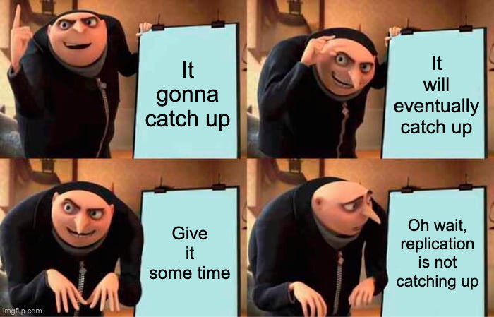

We had an interesting incident at work recently. We run huge databases on PostgreSQL, and to reduce disk fragmentation, we run `pg_repack`[^1] on a regular basis. This tool rewrites tables and indexes so that they are stored in contiguous blocks on disk. It reduces the overhead of disk seeks, improves read performance, and reduces the size of the database. Most importantly, it requires no downtime. That's a big win.

We also run `pg_logical`[^2] to replicate data from one database to another. This tool uses PostgreSQL's logical replication feature to do this. It's a powerful tool that allows us to replicate data from one database to another in real-time.

The incident was `pg_repack`[^1] finished successfully. But the replication stopped working. The WAL[^3] files stopped archiving. The replication lag was growing substantially, and at its peak, it was more than 1 TiB. We waited a few hours and eventually deleted and recreated the subscription.

During the process, we also found that someone had a similar issue and had raised it on GitHub[^4]. But there was no clear indication of what caused the issue.

## The C Path

This got me thinking: Many complex issues in databases are elusive since we don't have a working understanding of the database architecture and code. 

Most developers work at the application layer, and in most cases, that's all that is needed. However, when working with large databases, you need to have a working understanding of the database internals.

**The incident made me uncomfortable because I didn't know what to look for. I didn't know where to start.**

I have decided to take the C path to PostgreSQL. I have already worked on C and C++ for a few years, so getting back to it shouldn't be that hard. 

## The Plan

1. **Refresh my C knowledge** 
I will start with the basics and build complex data structures and algorithms in C.
1. **Build Cli tools like `ls`[^5] and `cat`[^6] in C** 
The plan is to understand file IO, string manipulation, and cli argument parsing.
1. **Build a simple shell parser in C** 
The plan is to understand process management, signals, IO, and system calls.
1. **Build a simple client-server application in C** 
The plan is to understand sockets, data serialization/deserialization, and connection management.
1. **Build a simple KV store in C** 
I have already built[^7] something similar in Ruby. I will most likely replicate the same in C.

 


This is in no way an absolute guide to understanding PostgreSQL. It is intended to hold me accountable and give me a structured path to understanding the database internals. I will document as much of what I learn as possible.


[^1]: https://reorg.github.io/pg_repack
[^2]: https://github.com/2ndQuadrant/pglogical
[^3]: https://www.postgresql.org/docs/13/wal-intro.html
[^4]: https://github.com/2ndQuadrant/pglogical/issues/113
[^5]: https://en.wikipedia.org/wiki/Ls
[^6]: https://en.wikipedia.org/wiki/Cat_(Unix)
[^7]: https://github.com/dineshgowda24/bitcask-rb